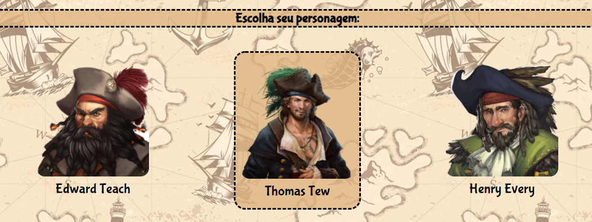

# ⚓ Não tire os olhos do horizonte ⛵

Projeto final de módulo (I) do curso de Web Dev Full Stack da [Resilia Educação](https://www.resilia.com.br/).

Projeto realizado utilizando [HTML](https://html5up.net/), [CSS](https://www.devmedia.com.br/exemplo/documentacao-de-css/56) e [JavaScript](https://www.javascript.com/).

Tema escolhido: Piratas

---

## 🎯 Objetivo

#

Criação de um jogo, que tem como mecanismo principal de funcionamento as escolhas feitas pelo usuário. Elas deverão levar
o jogador através de toda uma narrativa. Diferentes narrativas e fins podem
ser encontrados para os diferentes personagens jogáveis. A ideia principal é que diversos cenários e
escolhas resultem em "game over" e alguns poucos resultem em um final de sucesso.

---

## 📝 Requisitos

#

✅ - Todo mecanismo de interação entre jogador e jogo deve ser feito através do prompt.

✅ - Deve ser possível jogar com ao menos 3 personagens diferentes.

✅ - Ao menos 3 etapas/fases devem ser implementadas para cada personagem.

---

## 🌱Desenvolvido por

<b>Leonardo de Almeida Chaves 💻 </b>

---

Crédito
Imagens: https://www.brendavanvugtart.com/projects

---
